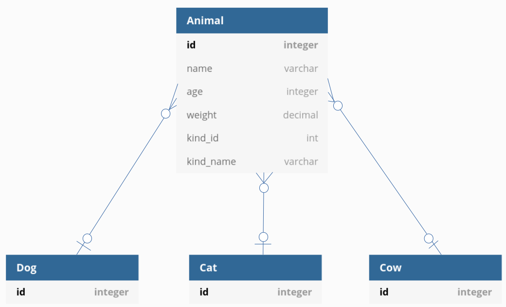

# Desafío parte II
# Creación del proyecto
```bash
rails new polymorphism_explained -d postgresql
```

# Los modelos
En nuestro ejemplo, un animal tiene varios atributos (como por ejemplo edad, peso, nombre) y pertenece a un especie (puede ser un perro, un gato, o una vaca). Los modelos se ven así:



## Generar los modelos
```bash
rails g model Animal name age:integer weight:decimal kind:references{polymorphic}
rails g model Dog
rails g model Cat
rails g model Cow
rails db:migrate
```
Acabamos de definir la relación de `Animal` a `kind`. Por la agregación de `{polymorphic}`, eso se traduce a dos columnas: `kind_id` y `kind_name`. En la clase de `Animal`, se ve así:

```ruby
class Animal < ApplicationRecord
  belongs_to :kind, polymorphic: true
end
```

## Declarando las relaciones
Ahora tenemos que decirle a rails que `Dog`, `Cat` y `Cow` son candidatos para ser un `kind`. Eso se hace de esta manera:

```ruby
class Dog < ApplicationRecord
  has_many :animals, as: :kind
end
```

```ruby
class Cat < ApplicationRecord
  has_many :animals, as: :kind
end
```

```ruby
class Cow < ApplicationRecord
  has_many :animals, as: :kind
end
```

Ahora, se puede pasar cualquier de los tres modelos como `kind` al `Animal`.

## Creando registros
Entramos en la consola de rails:
```bash
rails c
```

Entonces para crear un Animal, se lo hace así:
```bash
3.0.0 :001 > a = Animal.create(name: 'Braulio', age: 5, weight: 20.1, kind: Dog.new)
  TRANSACTION (0.3ms)  BEGIN
  Dog Create (0.9ms)  INSERT INTO "dogs" ("created_at", "updated_at") VALUES ($1, $2) RETURNING "id"  [["created_at", "2021-02-05 01:46:16.480840"], ["updated_at", "2021-02-05 01:46:16.480840"]]
  Animal Create (0.5ms)  INSERT INTO "animals" ("name", "age", "weight", "kind_type", "kind_id", "created_at", "updated_at") VALUES ($1, $2, $3, $4, $5, $6, $7) RETURNING "id"  [["name", "Braulio"], ["age", 5], ["weight", "20.1"], ["kind_type", "Dog"], ["kind_id", 1], ["created_at", "2021-02-05 01:46:16.484427"], ["updated_at", "2021-02-05 01:46:16.484427"]]
  TRANSACTION (34.7ms)  COMMIT
 => #<Animal id: 1, name: "Braulio", age: 5, weight: 0.201e2, kind_type: "Dog", kind_id: 1, created_at: "2021-02-05 01:46:16.484427000 +0000", updated_at: "2021-02-05 01:46:16.48442700...
```

Ahí se ve que en el campo `kind_type` rails puso el nombre del modelo `Dog`, y en el campo `kind_id` el `id` del registro `Dog` que acabamos de crear.
